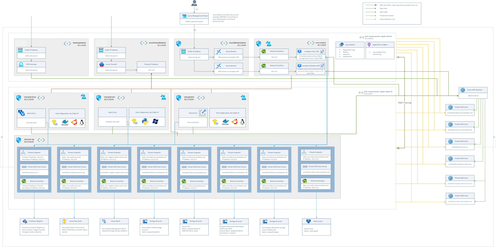

# AzFinSim on secured Azure Batch enviroment

- [AzFinSim on secured Azure Batch enviroment](#azfinsim-on-secured-azure-batch-enviroment)
  - [Prerequistes](#prerequistes)
  - [Deployment](#deployment)
  - [Monitoring](#monitoring)
  - [Executing the use-case](#executing-the-use-case)
    - [Populating the redis cache](#populating-the-redis-cache)
    - [Submitting jobs](#submitting-jobs)
    - [Resizing pool](#resizing-pool)
    - [Cleanup](#cleanup)
  - [Business Use-Case](#business-use-case)
  - [Infrastucture Overview](#infrastucture-overview)
  - [Short summary of the deployment:](#short-summary-of-the-deployment)

## Prerequistes

1. **Accept legal terms**: This example uses batch pools in user subscription mode. For that
   you need to accept the legal terms for the container image we use.
   To accept these legal terms,
   you need to execute the following Azure CLI command once. You can do this using
   the [Azure Cloud Shell](https://ms.portal.azure.com/#cloudshell/) in the Azure portal
   or your local computer. To run these commands on your local computer, you must have
   [Azure CLI](https://learn.microsoft.com/en-us/cli/azure/install-azure-cli) installed.

   ```sh
    # For Azure Cloud Shell, pick Bash (and not powershell)

    # If not using Azure Cloud Shell, `az login` may be needed
    # az login

    # accept image terms
    az vm image terms accept --urn microsoft-azure-batch:ubuntu-server-container:20-04-lts:latest
    ```

2. **Get Batch Service Id**: Based on your tenant, which may be differet, hence it's
   best to confirm. In [Azure Cloud Shell](https://ms.portal.azure.com/#cloudshell/),
   run the following:

   ```sh
    az ad sp list --display-name "Microsoft Azure Batch" --filter "displayName eq 'Microsoft Azure Batch'" | jq -r '.[].id'

    # output
    f520d84c-3fd3-4cc8-88d4-2ed25b00d27a
   ```

   If the output is different than the value shown then you will need to enter that value,
   instead of the default, for `batchServiceObjectId` (shown as **Batch Service Object Id**,
   if deploying using the portal) when deploying the infrastructure.

## Deployment

To deploy, you can use Azure CLI tools installed on your local machine or click
  **Deploy To Azure** button here.

[](https://portal.azure.com/#create/Microsoft.Template/uri/https%3A%2F%2Fraw.githubusercontent.com%2Futkarshayachit%2FAzureBatch-Secured%2Fazfinsim%2Fazuredeploy.json)

Using CLI, one can use the following form:

```sh
#-- login to CLI
az login

# set active subscription
az account set --subscription <subscription name>

#-- checkout the repo
git clone https://github.com/utkarshayachit/AzureBatch-Secured.git -b azfinsim 
cd AzureBatch-Secured

#-- deploy

# we use these variables just to make it easier to describe their purpose.

# Some nice and short name. This is used to identify the deployment. You can
# then easily monitor the progress on the Azure Portal
AZFS_DEPLOYMENT_NAME=dpl-azfinsim

# Location where all resources will be allocated
AZFS_LOCATION=eastus2

# A string to identify the creator. Just used to add tags to the resources/groups
# created to help identify them later.
AZFS_DEPLOYMENT_CREATOR=yourname

# A uniq string used in naming all resources. If not provided, one will be created
# automatically.
AZFS_PREFIX=some-small-uniq-string

# The id for Azure Batch service principal
# This only works on Linux Bash shell with `jq` intalled. You can also simply set this to the value
# returned by executing the same command in the Azure Clould Shell as described
# in the prerequisites.
AZFS_BATCH_OBJECTID=`az ad sp list --display-name "Microsoft Azure Batch" --filter "displayName eq 'Microsoft Azure Batch'" | jq -r '.[].id'`

az deployment sub create                  \
  --name $AZFS_DEPLOYMENT_NAME            \
  --location $AZFS_LOCATION               \
  --template-file main.bicep              \
  --parameters                            \
    resourceGroupLocation=$AZFS_LOCATION  \
    owner=$AZFS_DEPLOYMENT_CREATOR        \
    prefix=$AZFS_PREFIX                   \
    batchServiceObjectId=$AZFS_BATCH_OBJECTID
```

On success you'll be asked to enter a password to use to login to the jumbox VMs.
Create a secure password that you save since you'll need it later on. A mix of
upper case, lower case, and numbers is a good idea to aviod errors due to invalid
password.

This may take up to an hour.

If using the **Deploy To Azure** button, you'll be shown a lot more paramters
but only the ones set above in the CLI are sufficient.

On successful deployment, you can look at all resource groups created by browsing
to the **Resource Groups** listing in the Azure portal and then search for
`rg-dev-<prefix>`. If you didn't specify a prefix, and one was autogenerated, look at
the deployment details to find the prefix.

## Monitoring

To graphically monitor the pools/tasks and the computing activity,
we use **Azure Batch Explorer**. This is already deployed on the Windows Jumbox.
To view it, do the following:

- In the Azure Portal, search for `vm-jumbox-windows-1` under
  the `rg-dev-<prefix>-jumpbox` resource group.
- Navigate to the VM and Connect using Bastion. Use `localadmin` as the username
  (unless you changed that by specifying parameters during deployment) and then
  the password you choose during deployment. On success, you'll see the Windows box.
  When you login the first time, you'll choose some privacy settings etc.
  When done, you'll see a Windows desktop with **Batch Explorer** icon on the
  desktop. Double click to launch.
- **ISSUE**: The Batch Explorer may hang *Prompting for user input*, if it does that,
  right-click on its icon in the toolbar and choose close all windows. Next, using
  **Search**, search of Batch Explorer and launch the app again that way
  (don't use the desktop icon).
- Login to Azure using your credentials.
- The batch account of interest is named `badev<prefix>01`. Select that and then you
  can inspect the pools etc. by  clicking on corresponding icons on the vertical-left
  toolbar.

## Executing the use-case

Once the cache is populated, we can submit jobs.
We use the linux jumbox to inject data into the database and submit jobs to process
the trades.

- In the Azure Portal, search for `vm-jumbox-linux-1` under
  the `rg-dev-<prefix>-jumpbox` resource group.
- Navigate to the VM and Connect using Bastion. Use `localadmin` as the username
  (unless you changed that by specifying parameters during deployment) and then
  the password you choose during deployment. On success, you'll see the Ubuntu terminal.
- In the shell, you need to do the following the first time to setup the Python enviroment
  
```sh
# install required Python packages
pip3 install -r /azfinsim/src/requirements.txt
```

### Populating the redis cache

We have two options to populate the cache.

```sh
#----------------------------------------------------------------
# *** OPTION 1 ***: generates trades and pushes them. ===SLOW!===
#----------------------------------------------------------------

/azfinsim/scripts/generator.sh 
# here's the output
Generating synthetic trades
Incomplete environment configuration. These variables are set: AZURE_CLIENT_ID
[2022-09-19 22:13:55] [PID=2400]Starting trade generator...
[2022-09-19 22:13:55] [PID=2400]Generator Client: Logical Cores: 1
[2022-09-19 22:13:55] [PID=2400]Setting up cache connection
[2022-09-19 22:13:55] [PID=2400]Done.
[2022-09-19 22:13:55] [PID=2400]Starting the thread pool and filling the cache (1 threads)
[2022-09-19 22:13:55] [PID=2400]Generating 1000000 trades in range 0 to 999999
[2022-09-19 22:13:55] [PID=2400]Batchsize for pipeline to redis: 10000
[2022-09-19 22:13:55] [PID=2400]Generating batch: 0-9999
[2022-09-19 22:14:09] [PID=2400]Executing batch: 0-10000
[2022-09-19 22:14:10] [PID=2400]Generating batch: 10000-19999
[2022-09-19 22:14:22] [PID=2400]Executing batch: 10000-20000
[2022-09-19 22:14:23] [PID=2400]Generating batch: 20000-29999
[2022-09-19 22:14:32] [PID=2400]Executing batch: 20000-30000
[2022-09-19 22:14:32] [PID=2400]Generating batch: 30000-39999
[2022-09-19 22:14:42] [PID=2400]Executing batch: 30000-40000
[2022-09-19 22:14:42] [PID=2400]Generating batch: 40000-49999

#--------------------------------------------------------------------
# *** OPTION 2 ***: populates with pregenerated trades. ===FASTER!===
#--------------------------------------------------------------------

/azfinsim/scripts/inject.sh 
# here's the output 
Grabbing information about redis from key valut
...
Injecting 1 million trades into cache devuda0919redis.redis.cache.windows.net:6379
Warning: Using a password with '-a' or '-u' option on the command line interface may not be safe.
All data transferred. Waiting for the last reply...
Last reply received from server.
errors: 0, replies: 1000000

real0m43.103s
user0m2.189s
sys0m0.741s
```

You can view the redis cache's memory usage go up as we populate it by navigating
to the *Insights* tab on the `dev<prefix>redis` resource under the `rg-dev-<prefix>` resource group.

### Submitting jobs

You can submit jobs using the `submit.sh`. By default it only submits 1 job with 10 tasks. Edit the file
to uncomment some larger runs.

```sh
/azfinsim/scripts/submit.sh 
# here's the output
Using AZFINSIM_KEYVAULT_NAME=kv-dev-uda0919-ba
Incomplete environment configuration. These variables are set: AZURE_CLIENT_ID
[2022-09-19 22:31:20] [PID=3951]Starting job PV_MonteCarlo10K-20220919-223120 in pool linux-dev-pool
[2022-09-19 22:31:22] [PID=3951]Task task_000000, Command /bin/sh -c "/opt/azfinsim/src/azfinsim.py --keyvault kv-dev-uda0919-ba --cache-type redis --start-trade 0 --trade-window 100 --tasks 10 --task-duration 20 --format eyxml --algorithm pvonly --failu
re 0.0"
[2022-09-19 22:31:22] [PID=3951]Task task_000001, Command /bin/sh -c "/opt/azfinsim/src/azfinsim.py --keyvault kv-dev-uda0919-ba --cache-type redis --start-trade 0 --trade-window 100 --tasks 10 --task-duration 20 --format eyxml --algorithm pvonly --failu
re 0.0"
[2022-09-19 22:31:22] [PID=3951]Task task_000002, Command /bin/sh -c "/opt/azfinsim/src/azfinsim.py --keyvault kv-dev-uda0919-ba --cache-type redis --start-trade 0 --trade-window 100 --tasks 10 --task-duration 20 --format eyxml --algorithm pvonly --failu
re 0.0"
[2022-09-19 22:31:22] [PID=3951]Task task_000003, Command /bin/sh -c "/opt/azfinsim/src/azfinsim.py --keyvault kv-dev-uda0919-ba --cache-type redis --start-trade 0 --trade-window 100 --tasks 10 --task-duration 20 --format eyxml --algorithm pvonly --failu
re 0.0"
[2022-09-19 22:31:22] [PID=3951]Task task_000004, Command /bin/sh -c "/opt/azfinsim/src/azfinsim.py --keyvault kv-dev-uda0919-ba --cache-type redis --start-trade 0 --trade-window 100 --tasks 10 --task-duration 20 --format eyxml --algorithm pvonly --failu
re 0.0"
[2022-09-19 22:31:22] [PID=3951]Task task_000005, Command /bin/sh -c "/opt/azfinsim/src/azfinsim.py --keyvault kv-dev-uda0919-ba --cache-type redis --start-trade 0 --trade-window 100 --tasks 10 --task-duration 20 --format eyxml --algorithm pvonly --failu
re 0.0"
[2022-09-19 22:31:22] [PID=3951]Task task_000006, Command /bin/sh -c "/opt/azfinsim/src/azfinsim.py --keyvault kv-dev-uda0919-ba --cache-type redis --start-trade 0 --trade-window 100 --tasks 10 --task-duration 20 --format eyxml --algorithm pvonly --failu
re 0.0"
[2022-09-19 22:31:22] [PID=3951]Task task_000007, Command /bin/sh -c "/opt/azfinsim/src/azfinsim.py --keyvault kv-dev-uda0919-ba --cache-type redis --start-trade 0 --trade-window 100 --tasks 10 --task-duration 20 --format eyxml --algorithm pvonly --failu
re 0.0"
[2022-09-19 22:31:22] [PID=3951]Task task_000008, Command /bin/sh -c "/opt/azfinsim/src/azfinsim.py --keyvault kv-dev-uda0919-ba --cache-type redis --start-trade 0 --trade-window 100 --tasks 10 --task-duration 20 --format eyxml --algorithm pvonly --failu
re 0.0"
[2022-09-19 22:31:22] [PID=3951]Task task_000009, Command /bin/sh -c "/opt/azfinsim/src/azfinsim.py --keyvault kv-dev-uda0919-ba --cache-type redis --start-trade 0 --trade-window 100 --tasks 10 --task-duration 20 --format eyxml --algorithm pvonly --failu
re 0.0"
[2022-09-19 22:31:22] [PID=3951]Starting the thread pool (100 threads)
[2022-09-19 22:31:23] [PID=3951]Histogram of number of successful tasks submitted:
[2022-09-19 22:31:23] [PID=3951]0,1,2,3,4,5,6,7,8,9,10,11,12,13,14,15,16,17,18,19,20,21,22,23,24,25,26,27,28,29,30,31,32,33,34,35,36,37,38,39,40,41,42,43,44,45,46,47,48,49,50,51,52,53,54,55,56,57,58,59,60,61,62,63,64,65,66,67,68,69,70,71,72,73,74,75,76,7
7,78,79,80,81,82,83,84,85,86,87,88,89,90,91,92,93,94,95,96,97,98,99,100
[2022-09-19 22:31:23] [PID=3951]0,0,0,0,0,0,0,0,0,0,1,0,0,0,0,0,0,0,0,0,0,0,0,0,0,0,0,0,0,0,0,0,0,0,0,0,0,0,0,0,0,0,0,0,0,0,0,0,0,0,0,0,0,0,0,0,0,0,0,0,0,0,0,0,0,0,0,0,0,0,0,0,0,0,0,0,0,0,0,0,0,0,0,0,0,0,0,0,0,0,0,0,0,0,0,0,0,0,0,0,0
[2022-09-19 22:31:23] [PID=3951]Thread pool complete: 10 tasks in 0.6144390106201172 seconds (16.27500830376572 tasks per second, 0 task failures)
[2022-09-19 22:31:23] [PID=3951]Finished adding tasks. Setting job to auto terminate once all tasks complete.
```

If you navigate to the **Batch Explorer** in the Windows jumbox, you'll see a new job with tasks has been added to the `linux-dev-pool`.

### Resizing pool

By default, the `linux-dev-pool` has no nodes allocated to it. You can resize it using either **Batch Explorer** or from
the linux jumpobox as follows:

```sh
# resize the pool to 10 (default set to 0)
/azfinsim/scripts/resize_pool.sh 10
```

### Cleanup

- Resize the pool down to 0
  
```sh
# resize the pool to 0
/azfinsim/scripts/resize_pool.sh 0
```

- Delete all resource groups named `rg-dev-<prefix>` using the Azure Portal.

## Business Use-Case

This demo runs an application that models a typical Fintech Risk Simulation. The
application is a modifed version of the [AzFinSim example application](https://github.com/mkiernan/azfinsim).
The demo creates 1 million synthetic trades, inject them into a Redis cache and process
them with containerized application code on Azure Batch, capturing Telemetry in Application Insights.

AzFinSim is a reference implementation for automated (bicep) deployment of containerized Azure Batch applications which scales to 10's of thousands of cores. While the application provided is a synthetic risk simulation designed to demonstrate high throughput in a financial risk/grid scenario, the actual framework is generic enough to be applied to any embarrassingly parallel / high-throughput computing style scenario. If you have a large scale computing challenge to solve, deploying this example is a good place to start, and once running it's easy enough to insert your own code and libraries in place of azfinsim.

## Infrastucture Overview

The deployment demonstrates how Azure Batch could be deployed in a secured environment,
which is often a requirement in regulated industries such as Pharma, Life Sciences, or Banking
and Captial Markets.



## Short summary of the deployment:

Currently, the following resources are deployed to your Azure Subscription:

- Azure Batch will be deployed in User-Subscription mode 
- Azure Batch Service will be deployed in a private endpoint configuration
- All other services will be exposes through private endpoints. For instance:
  - Storage (Blob, NFS Share, SMB Share)
  - Azure Key Vault
  - Azure Container Registry
- No puplic IPs are exposed on the pool nodes (thus any outgoing traffic will be
  routed through the Azure Firewall)
- The Azure Batch Pool will be deplyed with a Managed Identity which has the
  permissions to pull images from the Azure Container Registry

- In total, 3 pools will be deployed in individual subnets:
  - linux-dev-pool (Static Scaling,Azure Container Registry configured, NFS Share mounted)
  - linux-prod-pool (Auto Scaling enabled, Azure Container Registry configured,
    NFS Share mounted, connection to the nodes via ssh not allowed)
  - windows-dev-pool (Static Scaling, SMB Share mouted, Pyhton installed on nodes)

- A VPN Gateway will be deployed as part of the end-to-end example, if enabled

- Azure Bastion Service will be deployed to allow access to the Linux and Windows
  Jumpboxes if a VPN Gateway is not desired.

- An Azure Firewall will be deployed and all internet bound traffic will be
 routed through Route Tables to the Azure Firewall. Rules are configured to allow Linux & Windows Updates and package retrieval.

- During the deployment a docker container will be created with the AzFinSim app
  and pushed to the secured ACR. The app uses managed identity created during deployment
  to access the key vault to fetch secrets such as redis cache url, port, access-key etc.
  The MI has RBAC permissions assingned on the Key Vault.

- The Windows Jumpbox will have the following software preinstalled:
  - Azure Batch Explorer
  - Azure Storage Explorer
  - Azure CLI

- The Linux Jumpbox will have the following additonal packages preinstalled:
  - azure-cli 
  - nfs-common 
  - jq 
  - will mount the blob storage (mounted through NFS 3)
  - azfinsim scripts to inject/generate data and submit jobs